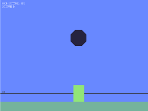

Piles
=====

My first app to study Phaser 3 <https://phaser.io/phaser3> and matter.js
<https://brm.io/matter-js/>

This app hires a template, ourcade's great work,  phaser3-parcel-template
<https://github.com/ourcade/phaser3-parcel-template>.

Snapshot
--------

License
-------

This software is released under the MIT License, see LICENSE.
